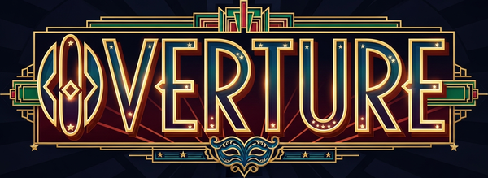

<p align="center">
  
</p>

A digital card game where players act as theater ushers, seating patrons to
maximize victory points and manage theater chaos.

## The Goal

Seat patrons strategically to earn victory points. Different patron types have
special placement rules and synergies!

📖 **[Read the full Rule Book](./docs/RULE_BOOK.md)** — covers all patrons, traits, theaters, and scoring in detail.

## 🚀 Play the Game

```bash
# Run the development server
deno task dev

# Open http://localhost:8080 in your browser
```

1. **Start** — Click "Start Game" on the title screen
2. **Select a Theater** — Click a theater board to select it, or hit Random
   Theater
3. **Select** — Click a card from your hand (bottom of screen)
4. **Place** — Click an empty seat in the theater grid to place that patron
5. **Score** — The game ends when the deck runs out (56 cards, 14 turns)

### Primary Patrons

| Type          | Strategy                                                                  |
| ------------- | ------------------------------------------------------------------------- |
| **Patron**    | Worth 3 VP anywhere.                                                      |
| **VIP**       | 5 VP base; +3 VP in front rows. Penalty near Kids and Noisy patrons.      |
| **Lovebirds** | 0 VP base; +3 VP if adjacent to another Lovebird. **×2 VP** in back rows. |
| **Kid**       | 0 VP base; 2 VP only if capped by Teachers on both ends of a group.       |
| **Teacher**   | 1 VP base; +1 VP for each adjacent capped Kid.                            |
| **Critic**    | 2 VP base; **×3 VP** if seated in an aisle seat.                          |

### Secondary Traits

Traits can be applied to any patron type, adding unique bonuses or penalties.

| Trait            | Effect                                                               |
| ---------------- | -------------------------------------------------------------------- |
| **Bespectacled** | +2 VP unless seated in the back row.                                 |
| **Tall**         | Patron directly behind this seat gets −2 VP.                         |
| **Short**        | +2 VP if no one is in front; −3 VP if a **Tall** patron is in front. |
| **Noisy**        | Each adjacent patron (any type) gets −1 VP.                          |

## 🛠️ Tech Stack

- **Runtime**: [Deno](https://deno.land/) — Modern JavaScript runtime with
  built-in TypeScript support
- **Bundler**: [Vite 5](https://vitejs.dev/) — Fast HMR and builds
- **Language**: JavaScript with JSDoc — Type-safe JS without compilation
- **Engine**: [Phaser 3](https://phaser.io/) — Popular 2D game framework

### 🧰 Available Tasks

All tasks are defined in `deno.json` and run via `deno task <name>`:

| Task      | Command                          | Description                                           |
| --------- | -------------------------------- | ----------------------------------------------------- |
| `dev`     | `deno run -A npm:vite@5`         | Start the Vite dev server with HMR                    |
| `build`   | `deno run -A npm:vite@5 build`   | Production build to `dist/`                           |
| `preview` | `deno run -A npm:vite@5 preview` | Preview the production build locally                  |
| `check`   | `deno check --doc src/**/*.js`   | Type-check JS files (validates JSDoc code blocks too) |
| `lint`    | `deno lint src/`                 | Lint source files with Deno's built-in linter         |
| `test`    | `deno test src/`                 | Run all unit tests                                    |
| `ci`      | `check → lint → test`            | Run the full CI pipeline sequentially                 |

### Running CI Locally

```bash
# Run all checks in one command (type-check → lint → test)
deno task ci

# Or run individually
deno task check
deno task lint
deno task test
```

## 🏗️ Project Structure

```
overture/
├── src/
│   ├── main.js            # Game entry point & Phaser config
│   ├── config.js          # Layout constants & responsive scaling
│   ├── types.js           # Card data, patron types, theater layouts, deck creation
│   ├── scoring.js         # Scoring engine — pure functions, no Phaser dependency
│   ├── scoring.test.js    # Unit tests for scoring & deck logic
│   ├── ai.js              # AI engine — pure functions, no Phaser dependency
│   ├── ai.test.js         # Unit tests for AI decision-making
│   ├── settings.js        # Runtime game settings
│   ├── scenes/
│   │   ├── BootScene.js   # Asset preloader with progress bar
│   │   ├── TitleScene.js  # Title screen & player setup
│   │   ├── TheaterSelectionScene.js  # Theater picker with previews
│   │   ├── GameScene.js   # Main gameplay
│   │   └── EndGameScene.js # Scorecard, winner & play-again
│   └── objects/
│       ├── Button.js      # Shared button helper
│       ├── Card.js        # Card game object (Container)
│       └── SpeechBubble.js # Tooltip that follows cards
├── index.html             # HTML entry point
├── deno.json              # Deno config, tasks & import map
├── vite.config.js         # Vite configuration
├── docs/
│   ├── GAME_DESIGN.md     # Full game design document
│   ├── RULE_BOOK.md       # Illustrated rule book for players
│   └── images/            # Screenshots & art for the rule book
└── README.md              # This file
```

## 🎮 Features

### Core Gameplay

- **Full Deck** — 56 cards with 6 patron types and 4 secondary traits
- **Card Hand** — Draw 3 cards per turn with visual selection and speech-bubble tooltips
- **Turn System** — 2-player pass-and-play with hand passing screen
- **Card Placement** — Click a seat to place the selected patron with animated feedback
- **Scoring Engine** — VIP front-row bonuses, Teacher/Kid capping, Lovebird pairing, Critic aisle multipliers, adjacency debuffs, and all trait interactions
- **Victory Points Display** — Running score during gameplay, toggleable in settings

### AI Opponents

- **3 Difficulty Levels** — Easy (random), Medium (greedy best-score), Hard (greedy + positional heuristics with jitter)
- **Player Setup Screen** — Choose human or AI per slot, pick difficulty, and swap player colors with a color picker
- **Seamless Integration** — AI turns auto-play with pacing delays; robot emoji marks AI players on the scoreboard

### Theaters

- **8 Unique Theaters** — Each with its own layout, background art, and house rule:
  - **The Grand Empress** — Classic 5×6 grid
  - **The Blackbox** — Compact 4×4 intimate space
  - **The Opera House** — Features isolated Royal Box seats with crown tags
  - **The Promenade** — Wide 7×4 layout with center aisle
  - **The Amphitheater** — Expanding rows (3→4→5→6), narrow front to wide back
  - **The Dinner Playhouse** — Table-style seating with gaps between groups
  - **The Ziegfeld Runway** — T-shaped stage extension splits the theater into left/right houses
  - **The Rotunda** — 5×5 hollow ring, theater-in-the-round (16 seats, no back row)
- **Theater Selection Screen** — Preview thumbnails with zoom animation and random theater option
- **Seat Label System** — Front row, back row, aisle, and Royal Box seats are tagged and scored automatically per layout

### Visual Design

- **1920s Art Deco Aesthetic** — Gold and deep purple palette throughout
- **Custom Patron Art** — Unique card art for all patron types and traits
- **Theater Backgrounds** — Hand-crafted AI-generated art for each venue
- **Art Deco Seat Tags** — Crown tags for Royal Boxes, gold borders for aisle seats, visible walkway strips between sections
- **House Rule Reminder** — Active house rule stays visible in the HUD all game

### Scenes & UI

- **Title Screen** — Animated logo with fullscreen toggle
- **Boot Screen** — Asset preloader with progress bar
- **End Game Screen** — Winner announcement, per-type scoring breakdown, and play-again option
- **Responsive Scaling** — DPR-aware, adapts to viewport aspect ratio, works on mobile

### Technical

- **Pure Scoring Engine** — No Phaser dependency, fully unit-tested (144 tests)
- **Pure AI Engine** — No Phaser dependency, fully unit-tested
- **Modular Scenes** — Boot → Title → Theater Selection → Game → End Game
- **Reusable Components** — Shared Button, Card, and SpeechBubble objects
- **CI Pipeline** — Type-check, lint, and test in one command

## 🧪 Testing

The project uses **Deno's built-in test runner** — no extra test framework
needed.

```bash
deno task test
```

**144 tests passing** across `scoring.test.js` (122 tests) and `ai.test.js` (22
tests).

Tests live alongside source files and cover:

- All 6 patron types and 4 traits scoring rules across all 8 theater layouts
- Theater-specific mechanics: Royal Box isolation, seat labels, house rules
- Edge cases: empty grids, unknown types, overlapping debuffs, back-row
  multipliers
- Deck creation: correct card count, patron distribution, and metadata
- AI decision-making: all 3 difficulty levels, card selection, and 2-player
  discard logic

Both the scoring engine (`src/scoring.js`) and AI engine (`src/ai.js`) are
intentionally kept as **pure functions with no Phaser dependency**, making them
straightforward to test in isolation.

## 📝 Notes

- **No audio** — Sound effects not yet added
- **JSDoc types** — All type annotations via JSDoc; `deno task check` validates
  them including code blocks in doc comments

## 📚 Documentation

- **[Rule Book](./docs/RULE_BOOK.md)** — Learn how to play: all patron types, traits, scoring rules, and 8 theaters explained with screenshots.
- **[Game Design Document](./docs/GAME_DESIGN.md)** — Full design spec including planned features (lobby, gifting, play cards, season deck).

## 🚧 Roadmap

- [ ] **Lobby** - Implement the lobby feature where players can draw from a market of available patrons instead of a random hand
- [ ] **Online Multiplayer** — Play with friends remotely
- [ ] **Play Variants** — Different "plays" with special rules
- [ ] **Audio** — Ambient theater sounds and placement effects
