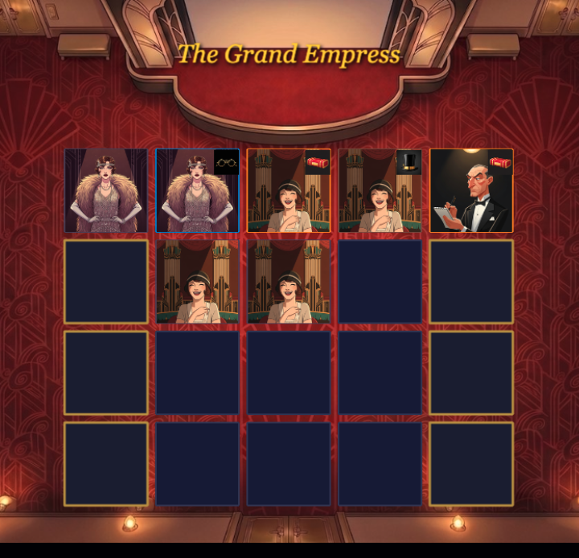

# TODO

- [ ]  Why is the AI choosing to put tall people in front, and the friend on row 2 column 2 was the latest placement it should have gone on row 2 column 4 for an additional point
- [ ] Players shouldn't see the AI's hand and deck draws. The hand should show the "back" and the deck animation should not flip the card. Only show the placement.
