

  

<h2 align="center">Rule Book</h2>

<em>A tableau-building card game for 2–4 players where rival ushers compete to seat patrons in their personal theaters for maximum victory points.</em>

---

## Table of Contents

1. [Overview](#overview)
2. [Setup & Game Flow](#setup--game-flow)
3. [Your Turn](#your-turn)
4. [The Theater Grid](#the-theater-grid)
5. [Patron Types](#patron-types)
6. [Secondary Traits](#secondary-traits)
7. [Trait Interactions & Combos](#trait-interactions--combos)
8. [Scoring Summary](#scoring-summary)
9. [Theaters](#theaters)
10. [Deck Composition](#deck-composition)
11. [End of Game](#end-of-game)

---

## Overview

You are a 1920s theater usher. Each player has their own theater grid — a seating chart where you'll place patron cards over 14 rounds. Your goal: **seat patrons strategically to earn the most victory points (VP)**.

Different patron types score points in different ways — VIPs want front-row seats, Critics crave the aisle, and Lovebirds need to sit together. On top of that, patrons can have secondary traits like Tall or Noisy that affect their neighbors.

The player with the **highest total VP** when the deck runs out wins.

---

## Setup & Game Flow

1. **Choose Players** — 2–4 players. Each can be human or AI (Easy, Medium, or Hard).
2. **Select a Theater** — All players share the same theater layout. Pick one or randomize it.
3. **Deal Hands** — Each player is dealt 3 cards from the shuffled 56-card patron deck.
4. **Play 14 Rounds** — Players take turns placing one card per round.
5. **Score** — After round 14, tally VP for every patron in your theater. Highest score wins!

  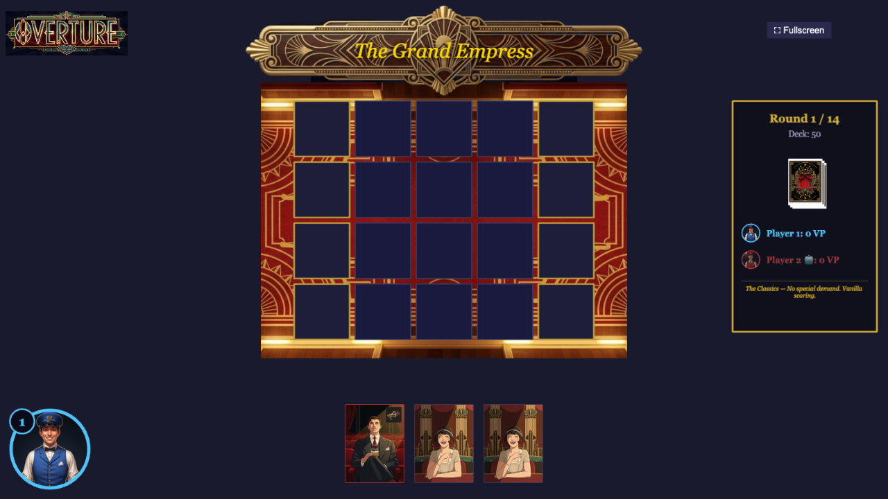
   <em>The game board: theater grid (center), your hand (bottom), round tracker & scores (right).</em>

---

## Your Turn

Each player starts the game with **1 card** in hand. On your turn:

1. **Draw** — You may either:
   - Pick one of the available cards from the **Lobby** (the shared market).
   - Click the **Deck** to draw a card blindly.
   - If neither the Deck nor Lobby has drawable cards left, skip drawing.
2. **Place** — select a card from your hand and click any empty seat in your theater to place it.

You usually end your turn holding **1 card**, ready for the next round.

### The Lobby System

The Lobby is a shared market of 3 face-up cards.

- **The Frozen Slot**: While the Deck still has cards, the first lobby card (slot 0) is unavailable.
- **Deck-Empty Unlock**: Once the Deck is empty, the frozen slot unlocks and any remaining Lobby card can be picked.
- **The Market**: Normally, the second and third cards can be picked by any player on their turn.
- **Refilling**: When a card is taken from the lobby, a new card is drawn from the deck and placed into the **frozen slot**, shifting the remaining cards to the right.
- **Information**: You can hover over any lobby card to see its scoring hints, even if it is frozen.

### 2-Player Variant

In a 2-player game the draw-and-discard rhythm changes:

1. **Draw 2** cards (via the Lobby or Deck) instead of 1, when possible.
2. **Place** one card into your theater.
3. **Discard** one of the remaining cards (it's removed from the game), if you still have extra cards.

You still normally end your turn with 1 card in hand.

### Hotseat Play

Overture is played **hotseat** — all players share the same screen. A hand-passing screen appears between every turn so the next player doesn't see your cards. Click **"I'm Ready"** to reveal your hand and begin your turn.

---

## The Theater Grid

Your theater is a grid of seats arranged in rows. The **stage** is at the top — the front row is closest to it, and the back row is farthest away.

Key seat types:

- **Front Row** — Rows closest to the stage. VIPs score bonus VP here.
- **Back Row** — The farthest row. Paired Lovebirds get a bonus here.
- **Aisle Seats** — Seats on the edges (marked with gold borders). Critics score bonus VP here.
- **Royal Box** — Special isolated seats in some theaters (marked with a crown). Count as both aisle and front row, but are **not adjacent** to regular seats.

---

## Patron Types

The deck contains **7 primary patron types**. Each card is one type, defining how it scores.

---

### Patron — The Reliable Regular

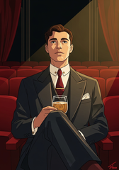

**3 VP** anywhere, no conditions.

The backbone of your theater. Drop them wherever you have a hole. They won't impress anyone, but they never disappoint.

 

---

### VIP — The High Roller

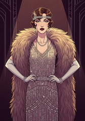

**3 VP** base. 
**+3 VP** if seated in a **front row** (first 2 rows). 
**−3 VP** per adjacent **Kid**. 
**−3 VP** per adjacent **Noisy** patron.

The rarest cards in the deck (only 4). Front-row VIPs score 6 VP — but keep them far from children and loud guests. A VIP next to a Noisy Kid can plummet to 0 VP.

 

---

### Lovebirds — The Inseparable Couple

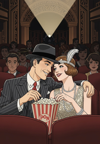

**1 VP** base (alone). 
**+3 VP** if **horizontally paired** — adjacent to another Lovebirds in the same row. 
**+2 VP** bonus if paired **and** in the **back row**.

Pairs only! Two adjacent Lovebirds = 4 VP each. Three in a row? The first two pair (4 VP each), the third is alone (1 VP). Four in a row = two pairs. Back-row pairs score 6 VP each — the sweet spot.

 

---

### Kid — The Wild Card

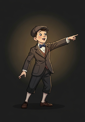

**1 VP** uncapped. 
**3 VP** when **capped** by Teachers.

A Kid is capped when a contiguous horizontal group of Kids has a **Teacher on both ends** (e.g., Teacher–Kid–Kid–Teacher). Uncapped Kids are nearly worthless. Cap them for big points!

 

---

### Teacher — The Chaperone

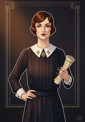

**3 VP** base. 
**+1 VP** per adjacent **capped Kid**.

Teachers are useful solo (3 VP), but shine when capping Kids. A Teacher flanking two capped Kids earns 5 VP (3 base + 1 + 1). Build Teacher–Kid–Teacher chains for maximum value.

 

---

### Critic — The Aisle Snob

**3 VP** base. 
**+3 VP** if seated in an **aisle seat** (gold-bordered). 
⚠ Bonus **nullified** if any adjacent patron has the **Noisy** trait.

Critics in the aisle score 6 VP — one of the easiest high-value placements. But a single Noisy neighbor kills the bonus entirely, dropping them to 3 VP.

 

---

### Friends — The Social Butterflies

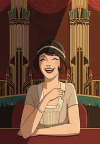

**3 VP** base. 
**+1 VP** per orthogonally adjacent **Friends**.

Friends reward clustering. Two adjacent Friends = 4 VP each. A Friends in a cross pattern touching 3 others = 6 VP. Build a Friends block and watch the points stack.

 

---

## Secondary Traits

About 43% of cards have a **secondary trait** on top of their primary type. Traits add bonuses or penalties that layer onto the base scoring. A card with a trait shows a **badge** in the corner.

---

### Tall

The patron seated **directly behind** this card gets **−2 VP**.

The Tall patron itself is unaffected. Place them in the **back row** where no one sits behind them to avoid the penalty.

 

---

### Short

**+2 VP** if the seat directly in front is **empty** (or this is the front row). 
**−3 VP** if a **Tall** patron is directly in front.

Short patrons love unobstructed views — place them in the front row or behind an empty seat. Never behind a Tall patron.

 

---

### Bespectacled

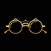

**+2 VP** unless seated in the **back row**.

Simple and strong. Front three rows = bonus VP. Back row = no bonus. A Bespectacled VIP in the front row scores 3 + 3 + 2 = **8 VP** — the highest-value single card possible in the base game.

 

---

### Noisy

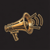

Each **orthogonally adjacent** patron (any type) gets **−1 VP**.

Noisy hurts everyone nearby — and also specifically **nullifies Critic aisle bonuses** and triggers **VIP adjacency penalties (−3 VP)**. Isolate them at edges or corners to minimize splash damage.

 

---

## Trait Interactions & Combos

Every card with a trait has **two identities** working together. Here are key combos to watch for:

| Combo                    | Strategy                                                                           |
| ------------------------ | ---------------------------------------------------------------------------------- |
| **Bespectacled VIP**     | Front-row dream: 3 + 3 + 2 = **8 VP**. Only 1 exists in the deck!                  |
| **Tall Lovebirds**       | Back row is safe (no one behind) AND gives the +2 pair bonus.                      |
| **Short Critic**         | Front-row aisle corner: 3 + 3 + 2 = **8 VP**. No one in front, aisle bonus active. |
| **Noisy Lovebirds**      | Pair them in the back row for 6 VP each, but beware neighbor damage.               |
| **Tall Kid**             | Worth only 1 VP uncapped AND blocks whoever sits behind. Rough card.               |
| **Noisy Kid**            | 1 VP and hurts neighbors — plus nullifies adjacent Critic aisle bonuses.           |
| **Short Friends**        | +2 VP in front row with no one ahead, on top of Friends clustering bonus.          |
| **Bespectacled Teacher** | Wants the front row for +2 VP, but needs to be next to Kids to cap them.           |

### Excluded Combos

These combinations **never appear** in the deck (by design):

- **Bespectacled Lovebirds** — Contradictory row incentives.
- **Short Lovebirds** — Same conflict (Short wants front, Lovebirds want back).
- **Noisy VIP** — VIPs penalize themselves for Noisy neighbors; self-penalty is confusing.
- **Noisy Friends** — The +1/−1 per neighbor cancels out, making the card pointless.

---

## Scoring Summary

Scoring happens in phases after the final round:

### Phase 1 — Primary Type

Each patron scores based on its type rules (see [Patron Types](#patron-types)).

### Phase 2 — Traits

Trait bonuses/penalties apply on top (Bespectacled +2, Short +2/−3, etc.).

### Phase 3 — Cross-Type Modifiers

These apply to **any** patron regardless of type:

- **Behind a Tall patron:** −2 VP (unless you are Short — Short has its own −3 penalty).
- **Adjacent to Noisy:** −1 VP per Noisy neighbor.

### Phase 4 — House Rule

The selected theater's house rule bonus is applied (see [Theaters](#theaters)).

### Quick Reference

| Type          | Base | Best Case | How                            |
| ------------- | :--: | :-------: | ------------------------------ |
| **Patron**    |  3   |     3     | Always 3 VP                    |
| **VIP**       |  3   |    6+     | Front row, no Kids or Noisy    |
| **Lovebirds** |  1   |     6     | Paired in back row             |
| **Kid**       |  1   |     3     | Capped by Teachers             |
| **Teacher**   |  3   |    5+     | Adjacent to 2+ capped Kids     |
| **Critic**    |  3   |     6     | Aisle seat, no Noisy neighbors |
| **Friends**   |  3   |     7     | 4 adjacent Friends (rare)      |

> **Traits add:** Bespectacled +2 (not back row) · Short +2 (no one in front) · Tall −2 (to patron behind) · Noisy −1 (to each neighbor)

---

## Theaters

Each game is played on one of **8 unique theaters**. The theater defines the grid layout and a **house rule** that modifies scoring.

---

### The Grand Empress

  

**House Rule: "The Classics"** — No special demand. Vanilla scoring.

The learning theater. Wide aisles make Critics strong. Broad rows are ideal for Teacher–Kid chains. A balanced starting point.

---

### The Blackbox

  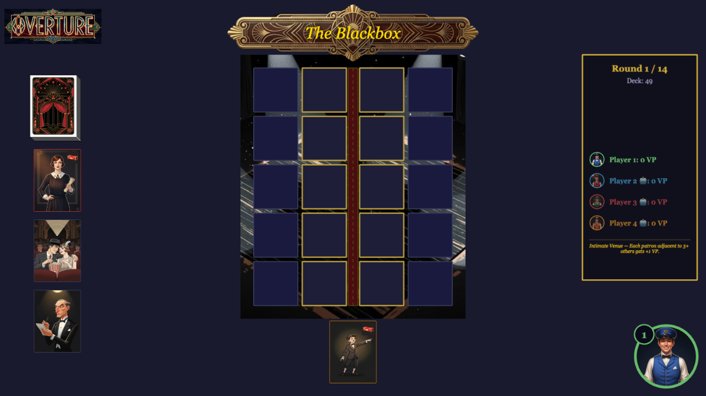

**House Rule: "Intimate Venue"** — Each patron adjacent to 3+ others gets **+1 VP**.

Narrow and deep (5 rows). Aisle seats are center-only, making Critic placement unintuitive. Dense packing earns bonus VP, but Noisy patrons punish exactly that density. Tall chains across 5 rows are devastating.

---

### The Opera House

  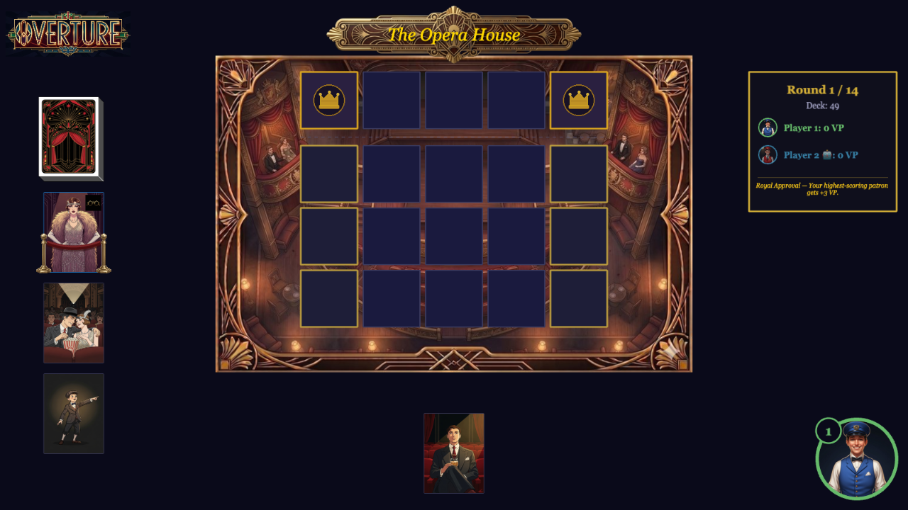

**House Rule: "Royal Approval"** — Your single highest-scoring patron gets **+3 VP**. Tiebreaker: front-most, then left-most.

Royal Boxes are isolated — they're not adjacent to any regular seats. A Bespectacled VIP in a Box: 3 + 3 + 2 + 3 = **11 VP**. Build one mega-patron and let Royal Approval crown them.

---

### The Promenade

  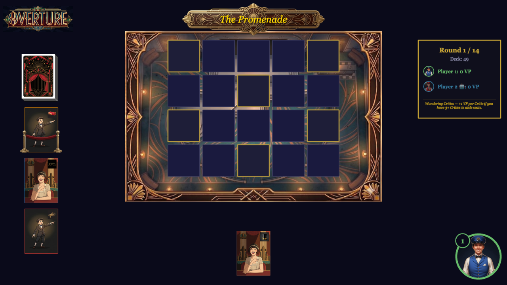

**House Rule: "Wandering Critics"** — +1 VP per Critic if you have **3+ Critics in aisle seats**.

Aisles shift row by row, so you can't stack Critics in one column. Spreading Critics across staggered aisles triggers the bonus. Forces creative placement.

---

### The Amphitheater

  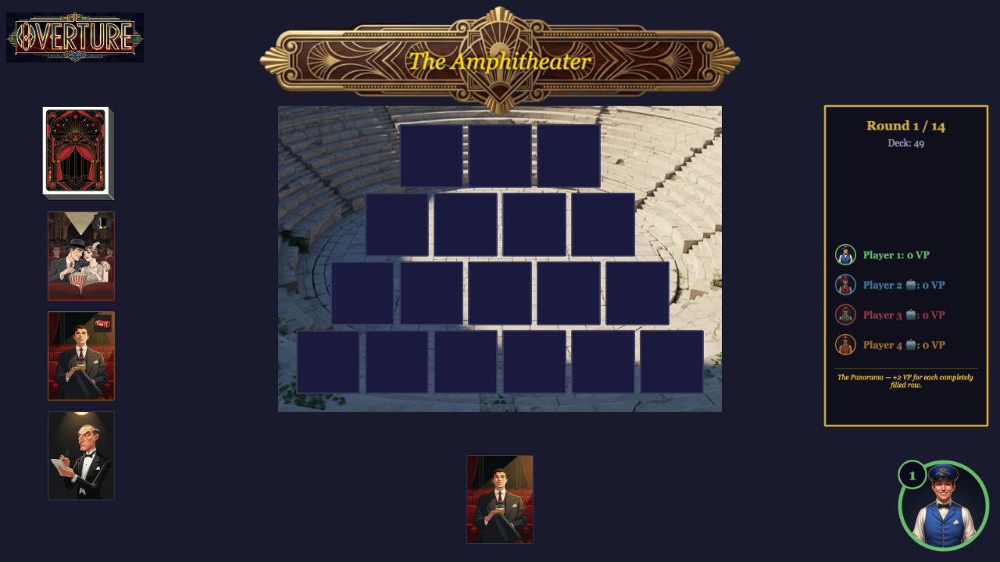

**House Rule: "The Panorama"** — **+2 VP** for each completely filled row.

Zero aisles = Critics are dead (3 VP only, no aisle bonus). The narrow 3-seat front row is easy to fill for Panorama bonus but scarce for VIPs. The wide 6-seat back row is Lovebirds paradise but hard to complete.

---

### The Dinner Playhouse

  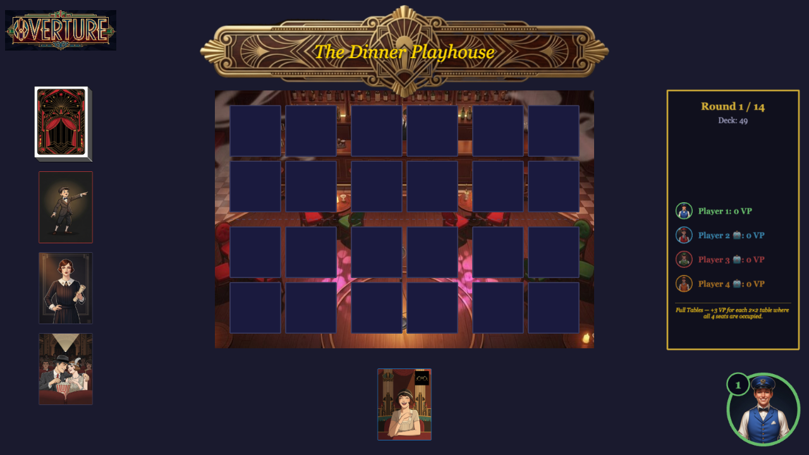

**House Rule: "Full Tables"** — **+3 VP** for each 2×2 table where all 4 seats are occupied.

**Special Capping Rule:** Normal Teacher–Kid chains don't work here (tables are only 2 wide). Instead, a Kid is **capped if any Teacher sits at the same table**. One Teacher can cap up to 3 Kids!

Gaps between tables break adjacency — Noisy only hurts tablemates. Lovebirds pair within a table row. Fill tables for +3 VP even if it means placing a mediocre card.

---

### The Balcony

  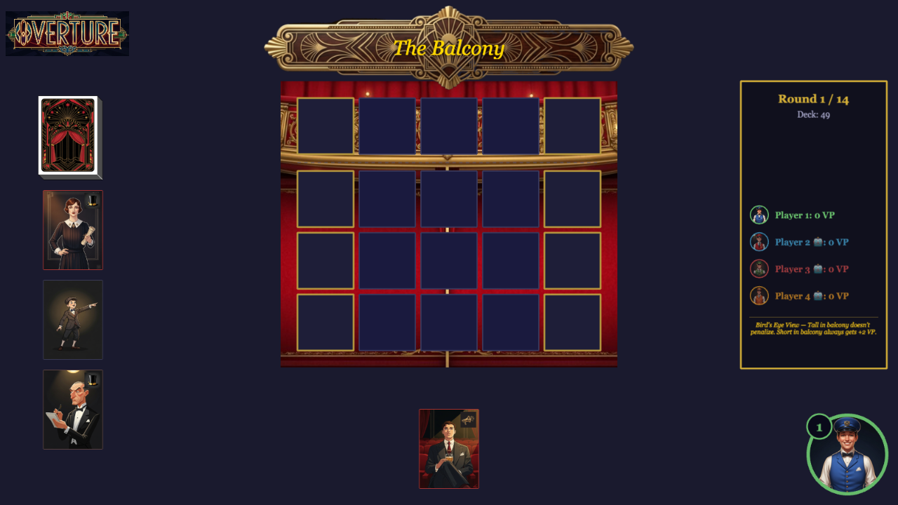

**House Rule: "Bird's Eye View"** — Tall patrons in the balcony (top row) **don't penalize** anyone. Short patrons in the balcony **always get +2 VP** (no one in front).

The balcony is a safe haven for problem cards — Tall and Short traits are neutralized. But it's also front-row real estate for VIPs and Bespectacled patrons. Waste it on damage control, or pack it with your best scorers?

---

### The Rotunda

  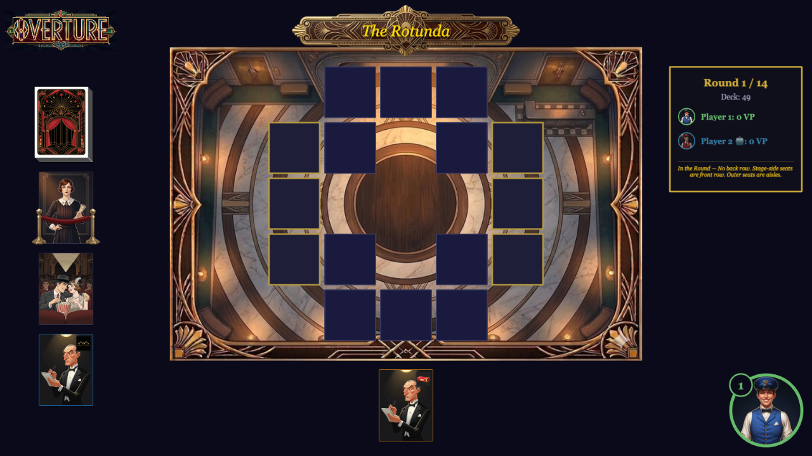

**House Rule: "In the Round"** — No back row. 10 inner-ring seats are front row. 6 outer-ring seats are aisles.

Everything changes in the round. VIPs are strong everywhere (10 front-row seats!). Bespectacled always gets +2 VP (no back row). Lovebirds lose their back-row bonus entirely. The hollow center breaks adjacency across the stage. Short patrons love the inner ring — many seats face empty stage positions.

---

## Deck Composition

**56 cards total** — 32 clean (no trait) + 24 with traits.

| Type          | No Trait | Tall  | Short | Bespectacled | Noisy | **Total** |
| ------------- | :------: | :---: | :---: | :----------: | :---: | :-------: |
| **Patron**    |    5     |   2   |   2   |      2       |   2   |  **13**   |
| **VIP**       |    3     |   —   |   —   |      1       |   —   |   **4**   |
| **Lovebirds** |    8     |   1   |   —   |      —       |   1   |  **10**   |
| **Kid**       |    5     |   1   |   1   |      —       |   1   |   **8**   |
| **Teacher**   |    3     |   1   |   1   |      1       |   —   |   **6**   |
| **Critic**    |    3     |   1   |   2   |      1       |   —   |   **7**   |
| **Friends**   |    5     |   1   |   1   |      1       |   —   |   **8**   |
| **Totals**    |  **32**  | **7** | **7** |    **6**     | **4** |  **56**   |

**Key distribution notes:**

- **Patron (13)** — Most common; reliable filler.
- **Lovebirds (10)** — Enough for pairing strategies.
- **Kid (8) vs Teacher (6)** — Fewer Teachers creates capping tension.
- **VIP (4)** — Rare high-value prizes. Seeing one is an event.
- **Noisy (4 total)** — Scarce but devastating when placed well.

---

## End of Game

1. The game ends after **round 14** (all hands played, 56 cards dealt across all players).
2. Each player's theater is scored as follows:
   - For each patron type calculate base VP and bonuses per seat.
     - Apply trait bonuses and penalties when adding each seat.
   -  Add the theater house rule bonus
3. The player with the **highest total VP** wins!
4. **Tiebreaker:**
   - The Lead Usher: The player who successfully seated the most Noisy patrons in their theater.
   - The Ensemble: If still tied, the player with the most unique Primary Types (diversity of audience).
   - The Final Call: If still tied, players share the victory, celebrating a well-attended show.

---

<em>Good luck, ushers. The curtain rises soon.</em>

